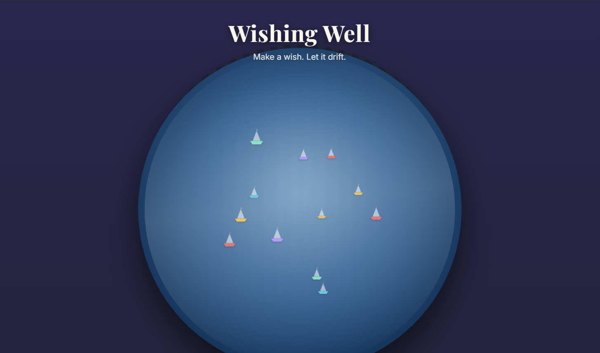
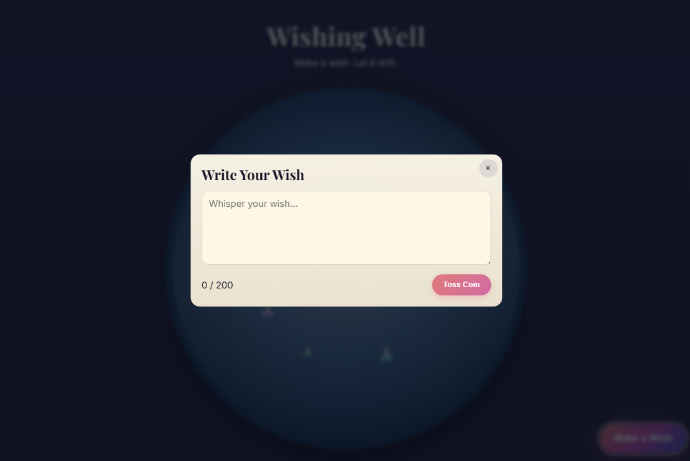
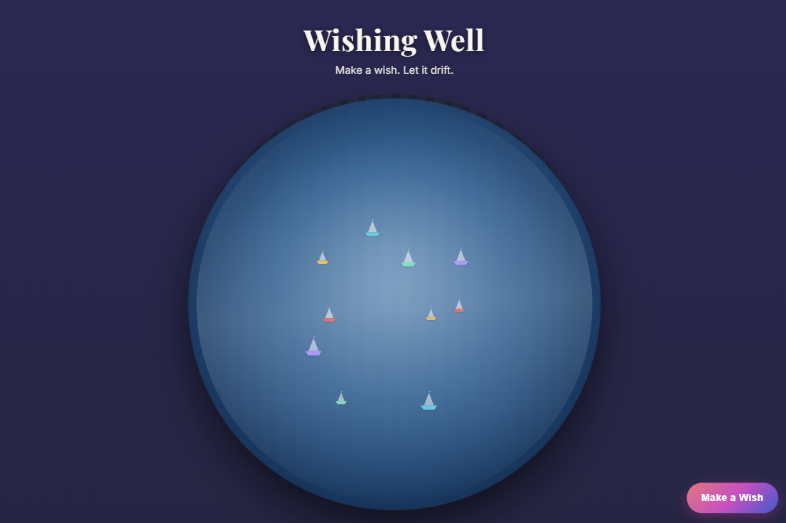
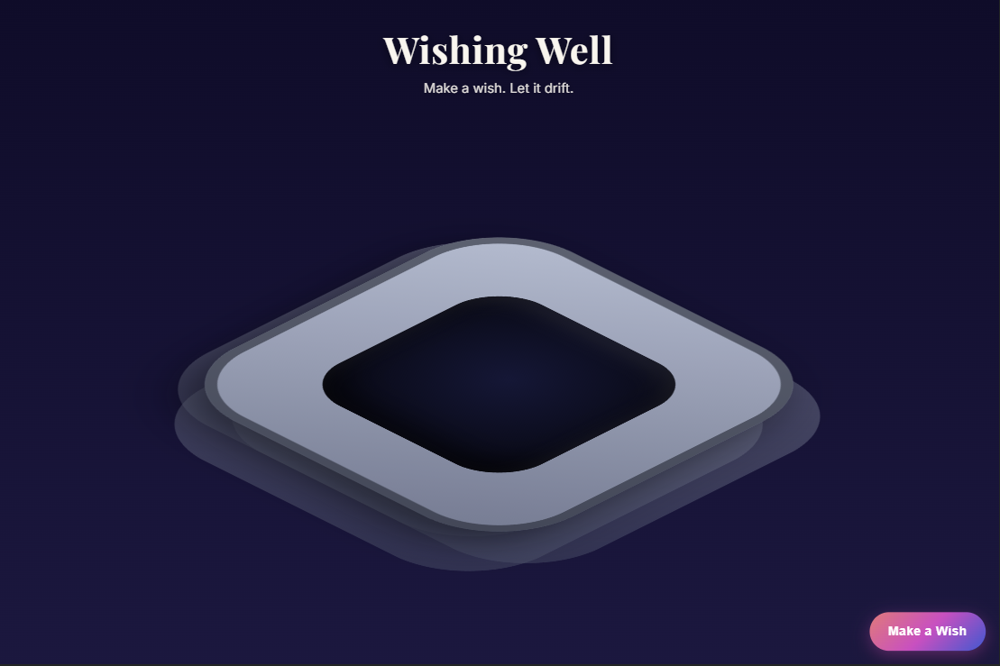

# ch-4 Personal Project — Report

## Project

- **GitHub username:** @nyan-dev
- **Repo URL:** https://github.com/nyan-dev/wishing-well
- **Live / download URL:** https://nyan-dev.github.io/wishing-well/
- **License:** MIT
- **One-line summary:** An interactive pixel-art wishing well where you write a wish, toss it as an origami boat, and discover wishes from others by clicking floating boats.

## Product-Intro Slides

- **Slides path:** slides/intro.md

## Demo Screenshots

- **Resolution used:** 1280×800 desktop

## Notes

- Firebase config is injected via `window.__WISHING_WELL_FIREBASE_CONFIG__` in index.html. Without it, wishes fall back to local storage.
- The well is drawn entirely on canvas (no SVG, no CSS 3D) using 16-bit pixel art with a restricted palette, dithered water, and stepped animation at 10fps.
- Boat click detection uses distance-based hit testing on the water canvas overlay.
